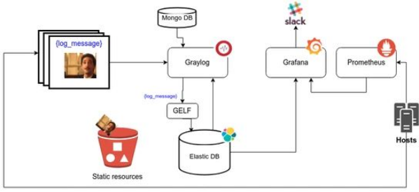

# Deployment of predictive models

## Diplomatura en Ciencia de Datos, Aprendizaje Automático y sus Aplicaciones

### Facultad de Matemática Astronomía Física y Computación
### Universidad Nacional de Córdoba


---
> Diplodatos 2020
## Table of contents

```
├── django-guestbook
│   ├── apps
│   └── kubernetes
├── kafka-kickstart
│   ├── kafka
│   └── notebooks
└── ml-api-public
    ├── api
    ├── doc
    ├── feedback
    ├── model
    ├── stress_test
    └── tests
```
* [django-guestbook](django-guestbook/README.md)

  Microservices using `brounder`, `postgres`, `redis` and `traefik`

* [kafka-kickstart](kafka-kickstart/README.md)
  
  Message queue using `Kafka`
  
* [ml-api-public](ml-api-public/README.md)

  Deployment of predictive models using docker containers, such as 
  * `flask_api` REST Api
  * `redis` Message queue
  * `spanish_sentiment_analysis` in `model` container as Model
  * `locust` tests users
  * `Graylog` and `elasticsearch` to see logs
  * `Grafana` Monitoring
  
  

## Instalar y ejecutar

```
$ docker-compose up --build -d
```

Para detener los servicios:

```
$ docker-compose down
```

## Tests

- Instalar un virtualenv con los requirements.txt del origen
```
virtualenv --python=python3.5 .env
source .env/bin/activate
pip install -r requirements.txt
```
- Correr los tests con nosetests
```
nosetests [<package_name>]
```

- Si no tienen python3.5 y no lo quieren instalar, pueden probar instanciando un container con python 3.5 montando un volumen para ver los cambios dinamicamente

```
docker run -v $(pwd):/src -it --net=host -w /src python:3.5 bash
pip install -r requirements.txt
nosetests [<package_name>]
```
