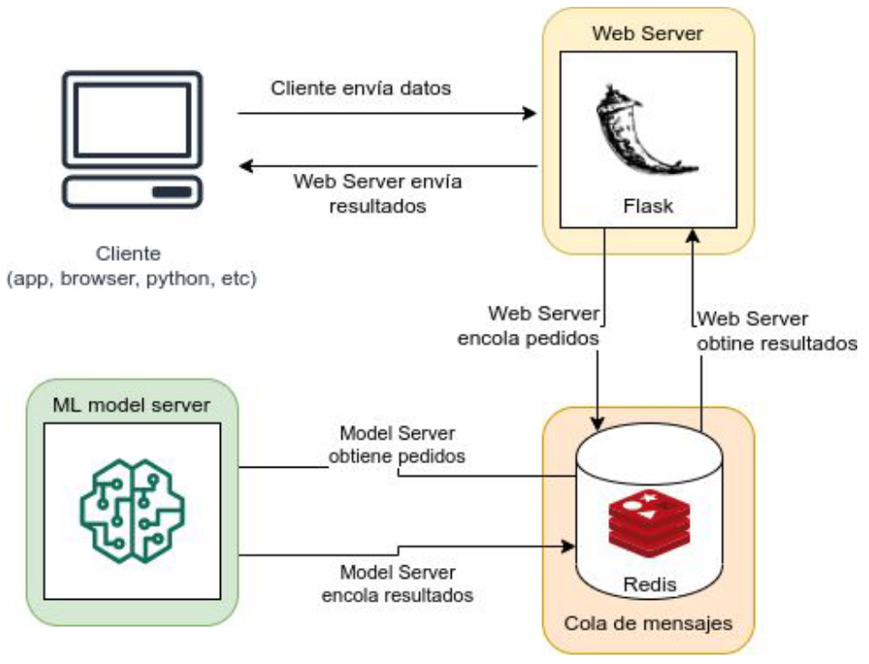

# Despliegue de sistemas predictivos
> Diplodatos 2020

## Arquitectura Mejorada

Elementos

 * Cliente
 * REST API Flask
   - su funcion es generar un trabajo a travez de redis, y eperar a que algun
   consumidor del otro lado responda el mensaje y devuelva la respuesta a la
   REST.
 * Redis
   - Cola de mensajes.
   - Motor de base de datos en memoria, basado en el amacenamiento de tablas de
     hash (clave/valor)   
   - Soporta la replicacion del tipo Maestro-Escalvo. Se puede replicar los
     datos de un servidor a muchos esclavos.
 * ML model
   - Modelo de Machine Learning



* Pros
  * Permite escalar cada componente por separado de forma sencilla
  * Se puede actualizar cada componente independientemente
  * Permite agregar fácilmente herramientas adicionales a nuestro pipeline
    - Para el caso en el que Modelo sea un cuello de botella, esto permite
      replicar los modelos de ML todos usando la misma instancia de redist. Esto
      permite escalar el modelo su tener que replicar la rest api
  
* Cons
  * Requiere el uso y conocimiento de herramientas adicionales
  * Una mala configuración puede empeorar nuestra perfomance significativamente
  * Más difícil de debuggear, necesitamos una suite de tests robustos
    - Test de integracion.

## Instalar y ejecutar

```
$ docker-compose up --build -d
```

Para detener los servicios:

```
$ docker-compose down
```

## Tests

- Instalar un virtualenv con los requirements.txt del origen
```
virtualenv --python=python3.5 .env
source .env/bin/activate
pip install -r requirements.txt
```
- Correr los tests con nosetests
```
nosetests [<package_name>]
```

- Si no tienen python3.5 y no lo quieren instalar, pueden probar instanciando un
  container con python 3.5 montando un volumen para ver los cambios
  dinamicamente

```
docker run -v $(pwd):/src -it --net=host -w /src python:3.5 bash
pip install -r requirements.txt
nosetests [<package_name>]
```
### Test de integracion

```sh
python -m unittest tests/test_integration.py
```
